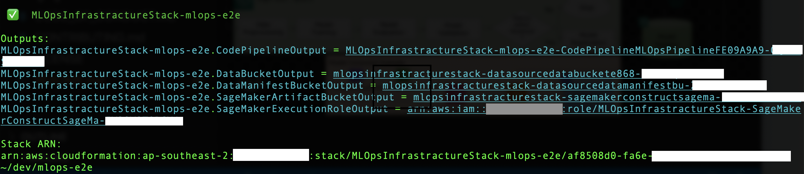
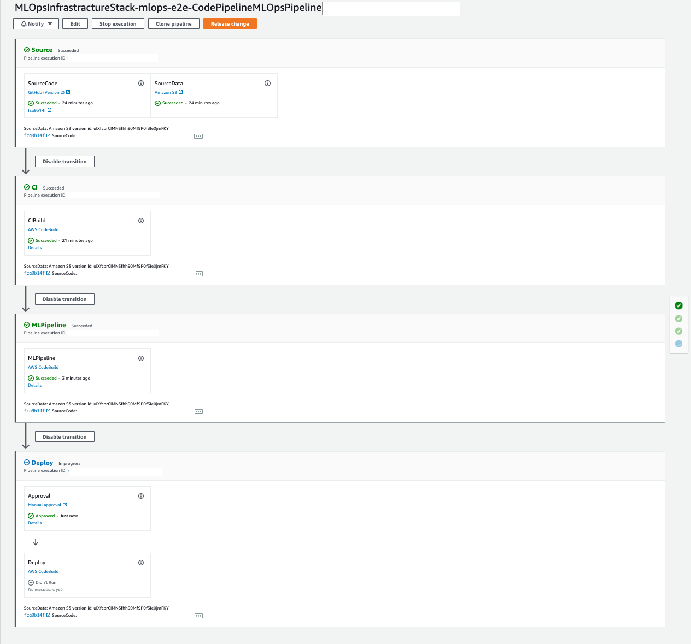
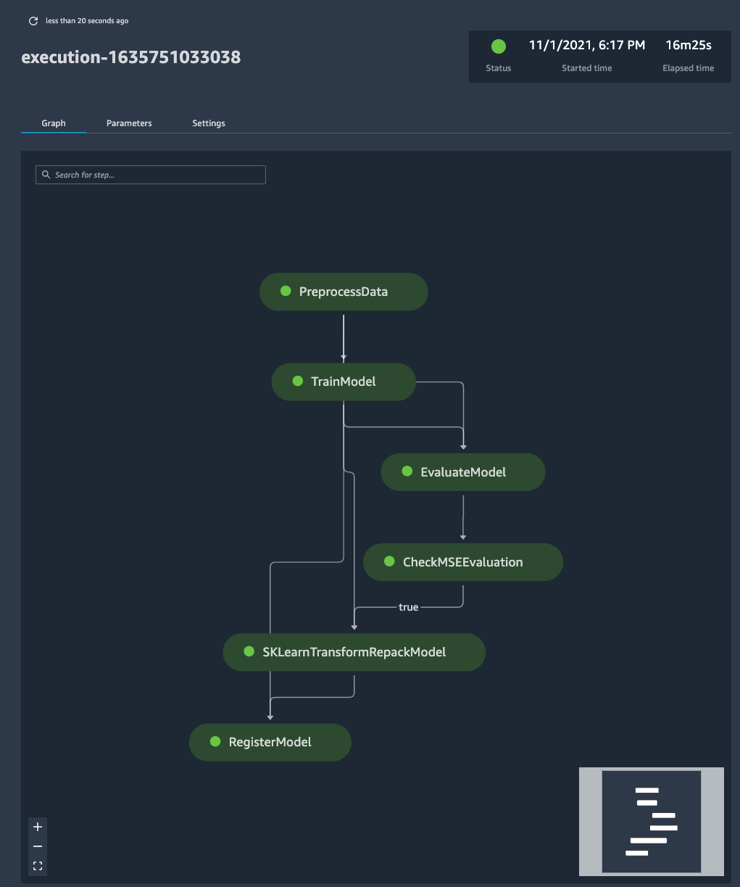
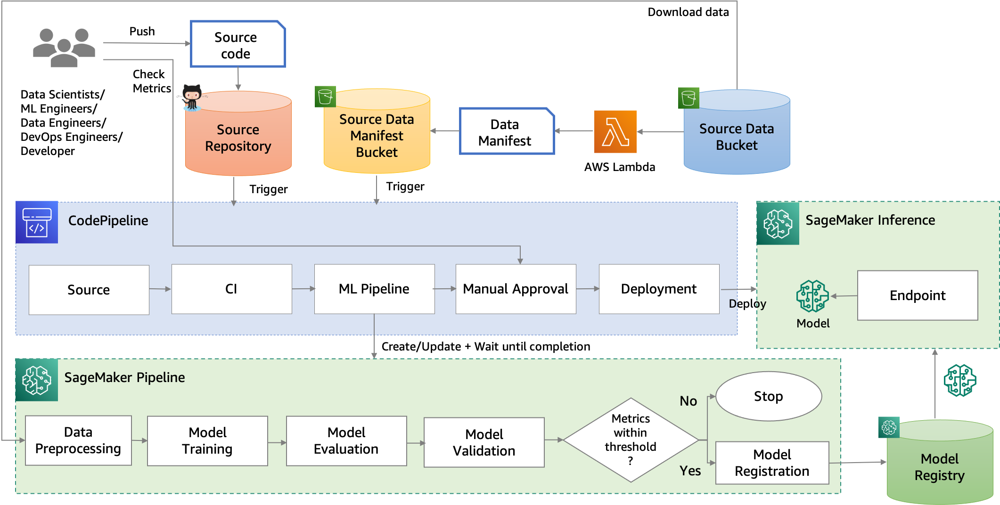

# MLOps End-to-End Example using Amazon SageMaker Pipeline, AWS CodePipeline and AWS CDK

This sample project uses a sample machine learning project to showcase how we can implement MLOps - CI/CD for Machine Learning using [Amazon SageMaker](https://aws.amazon.com/sagemaker/),  [AWS CodePipeline](https://aws.amazon.com/codepipeline/) and [AWS CDK](https://aws.amazon.com/cdk/)

## Pre-requisite

* [Python](https://www.python.org/) (version 3.8 or higher)
* [NodeJS](https://nodejs.org/en/) (version 14 or higher)
* [Yarn](https://yarnpkg.com/) (installed via `npm install -g yarn`)
* [Typescript](https://www.typescriptlang.org/) (installed via `npm install -g typescript`) 
* [AWS CDK v2](https://aws.amazon.com/cdk/) CLI (installed via `npm install -g aws-cdk`)
* [AWS CLI](https://aws.amazon.com/cli/)  (version 2 or higher)
* [AWS CLI Configuration](https://docs.aws.amazon.com/cli/latest/userguide/cli-configure-quickstart.html) (configured via `aws configure`)

## Configuration

### Source Repo

#### Option 1: Use GitHub Repo

1. Fork this repo in your GitHub account
1. [Create a GitHub connection using the CodePipeline console](https://docs.aws.amazon.com/codepipeline/latest/userguide/connections-github.html) to provide CodePipeline with access to your Github repositories *(See session Create a connection to GitHub (CLI))* 
1. Update the GitHub related configuration in the `./configuration/projectConfig.json` file
    * Set the value of *repoType* to *git*
    * Update the value of *githubConnectionArn*, *githubRepoOwner* and *githubRepoName*

#### Option 2: Create a CodeCommit Repo in your AWS account

Alternatively, the CDK Infrastructure code can provision a CodeCommit Repo as Source Repo for you. 

To switch to this option, set the value of *repoType* to *codecommit* in the `./configuration/projectConfig.json` file.
 
### IP Permit List

Please note that for simplicity, the API endpoint for the online model consumers is not protected by any authentication process. By default, it can be accessed by anyone from the internet. Please update the value of *ipPermitList* in the `./configuration/projectConfig.json` to include only the CIDR block of your network. 

## Usage

**Important**: this application uses various AWS services and there are costs associated with these services after the Free Tier usage - please see the AWS Pricing page for details. You are responsible for any AWS costs incurred. Please follow the **Cleanup** Section to clean up resources after your usage. No warranty is implied in this example.

### Bootstrap
Run the command below to provision all the required infrastructure.

```
./scripts/bootstrap.sh
```

The command can be run repatedly to deploy any changes in this folder. 

#### Clodformation Output

If the script is run successfully, a list of Cloudformation Output will be printed out in the console as shown in the screenshot below:



You can find the name of the newly created Cloudformation Stack, CodePipeline, Data S3 Bucket, Data Manifest S3 Bucket, SageMaker Artifact S3 Bucket and SageMaker Execution Role. 

If you navigate to the CodePipeline console, you should see the newly created CodePipeline, as shown in the screenshot below: 



If you are using *CodeCommit Repo*, Refer to *Source Code* Section on how to push the source code to the newly created CodeCommit Repo.

If you are using *Github Repo*, the CodePipeline should be connected to your Github Repo already. Refer to *Testing Data Set* Section on how to upload the testing data set to trigger the pipeline.   

#### Source Code

If **repoType** is *codecommit*, after the cloudformation stack is created, follow [this page to connect to the CodeCommit Repo](https://docs.aws.amazon.com/codecommit/latest/userguide/how-to-connect.html) and push the content of this folder to the **main** branch of the repo. 

**Note**: The default branch may not be **main** depending on your Git setting. 

Once the source code is pushed to the repo, the CodePipeline will be triggered, but the CI stage will fail given that the testing data set has not been uploaded yet. Refer to *Testing Data Set* Section on how to upload the testing data set.

#### Testing Data Set

Download a copy of testing data set from `https://archive.ics.uci.edu/ml/datasets/abalone`, and upload it to the Data Source S3 Bucket (The bucket name starts with *mlopsinfrastracturestack-datasourcedatabucket...*) under your prefered folder path, e.g. *yyyy/mm/dd/abalone.csv*.

Alternatively, you can run the scripts below to download a copy of testing data set and upload to the **Empty** data bucket.  

```
./scripts/uploadTestingDataset.sh
```

Once the data is uploaded to data bucket, the CodePipeline should be triggered automatically.

#### SageMaker Pipeline

During the CodePipeline run, a SageMaker Pipeline named `mlops-e2e` (The projectName in the `configuration/projectConfig.json` file) will be created or updated. 

To inspect the newly created SageMaker Pipeline, you can [setup SageMaker Studio](https://docs.aws.amazon.com/sagemaker/latest/dg/studio.html) and Navigate to the SageMaker Pipeline list from the SageMaker Studio, as shown in the screenshow below:



When there are any issues during the MLPipeline stage of the CodePipeline run, the best way to troubleshoot is to navigate to the SageMaker Pipeline details page in the SageMaker Studio for the logging information.  

#### Model Consumer

After the CodePipeline run is completed (including the Manual-approval-gated Deploy stage), the Model Consumer example can be deployed. See section *ML Model Consumers* for more details. 

### Cleanup

To clean up all the infrastructure, run the command below:

```
./scripts/cleanup.sh
```

**Note**: If you have bootstraped the model consumer example, you will need to clean up the model consumer infrastructure resources first. Refer to the [README file](./consumers/online/README.md) for more details and instructions on how to clean up the example infrastructure. 

## Sample Machine Learning Project

The project is created based on the [SageMaker Project Template - MLOps template for model building, training and deployment](https://docs.aws.amazon.com/sagemaker/latest/dg/sagemaker-projects-templates-sm.html#sagemaker-projects-templates-code-commit).

In this example, we are solving the abalone age prediction problem using a sample dataset. The dataset used is the [UCI Machine Learning Abalone Dataset](https://archive.ics.uci.edu/ml/datasets/abalone). The aim for this task is to determine the age of an abalone (a kind of shellfish) from its physical measurements. At the core, it's a regression problem.

## Project Layout

* `buildspecs`: Build specification files used by CodeBuild projects
* `configuration`: Project and Pipeline configuration
* `consumers`: Examples how to consume the inference model
* `docs`: Images used in the documentation 
* `infrastructure`: [AWS CDK](https://docs.aws.amazon.com/cdk/latest/guide/home.html) app for provisioning the end-to-end MLOps infrastructure
* `ml_pipeline`: The SageMaker pipeline definition expressing the ML steps involved in generating an ML model and helper scripts 
* `model_deploy`: [AWS CDK](https://docs.aws.amazon.com/cdk/latest/guide/home.html) app for deploying the model on SageMaker endpoint
* `scripts`: Bash scripts used in the CI/CD pipeline
* `src`: Machine learning code for peprocessing and evaluating the ML model
* `tests`: Unit testing code for testing machine learning code

## Overall Architecture

The overall archiecture of the sample project is shown below:



### Code Pipeline

When there is a new version of source code or there is a new version of data, the CodePipeline (serving as MLOps pipeline) is triggered to run CI step to test the ML Code and build the infrastruture code, followed by the MLPipeline step. In the MLPipeline step, a SageMaker Pipeline is created/updated to preprocess the raw data, train and evaluate the ML model. In the Deploy Step, the trained model is deployed as SageMaker endpoint after manual approval.  

The CodePipeline is defined as CDK construct in the `./infrastructure/codePipelineConstructure.ts` file. 

### Training Data

When a new data file is uploaded into the Data Source S3 Bucket, a lambda function defined in the `./infrastructure/functions/dataSourceMonitor` folder is triggered to generate a new data manifest file to specify what raw data should be included in the training and then upload it into the Data Manifest s3 Bucket. And the new version of this file triggers the CodePipeline. 

By default, all the files inside the Data Source S3 Bucket are used in the training job. The source code can be updated to only include data files within certain date range.

### SageMaker Pipeline

The SageMaker Pipeline is defined by the python code in the `./ml_pipeline` folder. The source code for preprocessing and evaluating data is located in the `./src` folder. 

### Inference Pipeline Model

In the preprocessing job (specified in the `./src/preprocess.py` file), we leverages sklearn-kit to transform the data. During the inference, the same preprocessor is expected to be used to transform the inference data. So in the SageMaker Pipeline, we build a inference pipeline model including the preprossor and the inference model to create a pipeline model package so that an inference pipeline can be deployed to process the raw data and send it to the prediction model for predication. A transform step defined in the file `./src/transform.py` is used to map the input and output of the preprossor during the inference. 

### Model Deploy

The Model Deployment is managed by the CDK stack defined in the `./model_deploy` folder. The model is deployed into **persistent** [SageMaker Real-time Inference endpoint](https://docs.aws.amazon.com/sagemaker/latest/dg/realtime-endpoints.html). 

## ML Model Consumers
### Online Inference

An example on how to consume the inference model is available in the `consumers/online` folder.

Refer to the [README file](./consumers/online/README.md) for more details and instructions on how to deploy the example. 

## License
This project is licensed under the [MIT-0](./LISENSE).

## Contributing
Refer to [CONTRIBUTING](./CONTRIBUTING) for more details on how to contribute to this project.

## References

* [SageMaker Project Template - MLOps template for model building, training and deployment](https://docs.aws.amazon.com/sagemaker/latest/dg/sagemaker-projects-templates-sm.html#sagemaker-projects-templates-code-commit)
* [Preprocess input data before making predictions using Amazon SageMaker inference pipelines and Scikit-learn](https://aws.amazon.com/blogs/machine-learning/preprocess-input-data-before-making-predictions-using-amazon-sagemaker-inference-pipelines-and-scikit-learn/)