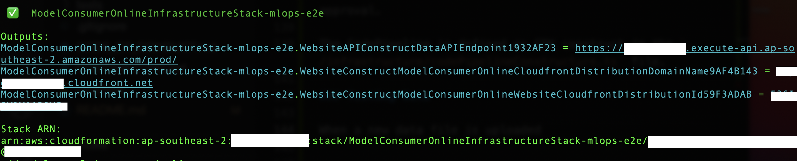
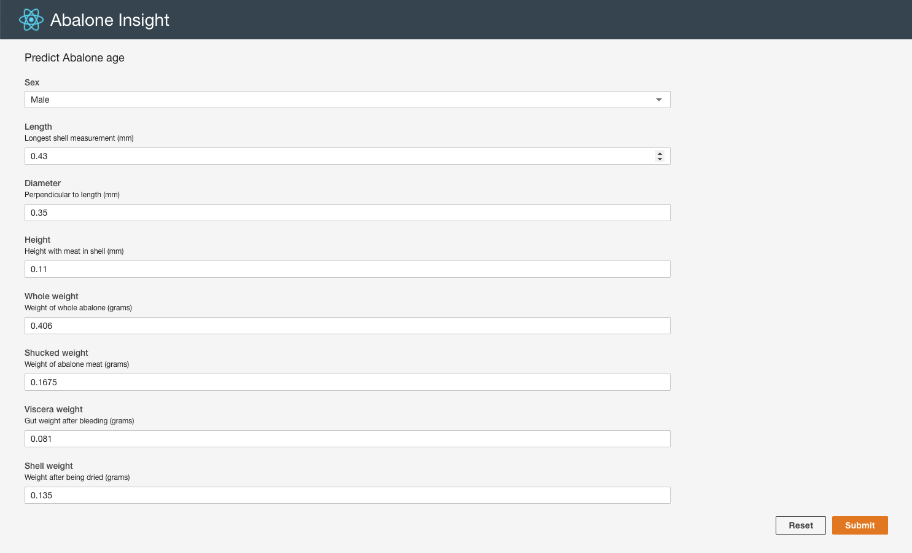
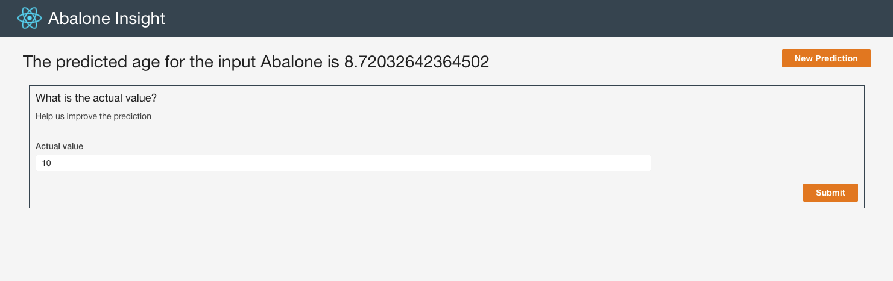

# Online Consumer of ML Inference Model

This folder includes an example how to consume the ML Inference Model via the SageMaker Hosting Endpoint. The solution is developed in Typescript.

## Solution Structure

The `infrastructure` folder includes the infrastructure code for provisioning the backend API for serving the inference requests from user input and user feedback requests, as well as website hosting for hosting the ui. 

The `website` folder includes the code of a Single Page App (SPA) for getting user input, displaying inference result, and getting user feedback. 

## Usage

### Bootstrap

Run the command below to provision all the required infrastructure.

```
bootstrap.sh
```

The command can be run repatedly to deploy any changes in this folder. 

#### Cloudformation Output

If the script is run successfully, a list of Cloudformation Output will be printed out in the console as shown in the screenshot below:



#### Cloudfront Web Frontend

You can visit the cloudfront url to try out the model inference using the testing data set. 





In the result page, you can submit the actual value and the value will be recorded in a DynamoDB table.

#### API Request

You can also run a curl command against the API Gateway endpoint. 

For example, 
```
curl 'https://<api_gateway_url>/prod/data' \
  -H 'content-type: application/json' \
  -H 'accept: */*' \
  --data-raw '{"sex":"M","length":"0.43","diameter":"0.35","height":"0.11","wholeWeight":"0.406","shuckedWeight":"0.1675","visceraWeight":"0.081","shellWeight":"0.135"}'
```

### Cleanup

To clean up all the infrastructure, run the command below:

```
cleanup.sh
```

